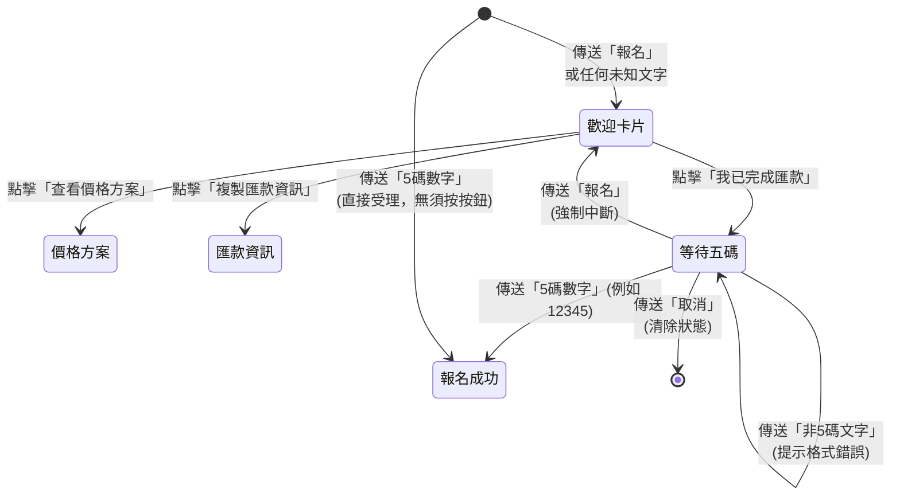

# Vibe Coding Landing Page + GAS + LINE

這是一個給課程／服務型產品使用的一頁式銷售網站範本，技術組合是 `Next.js App Router + TypeScript + Tailwind CSS`，網站可靜態部署到 GitHub Pages，報名流程可串接 `LINE 官方帳號 + Google Apps Script（GAS）+ Google Sheet`。

如果你是程式小白，這份 README 不是只告訴你「指令怎麼下」，而是會先告訴你：

- 前端在做什麼
- 後端在做什麼
- LINE 官方帳號要怎麼設定
- Google Sheet / GAS 在整個流程裡扮演什麼角色
- 你應該先做哪一步、再做哪一步

你可以把這個專案理解成一個「從零到一把招生頁做出來」的骨架。

---

## 1. 先看懂整體：這個專案到底在做什麼？

### 1.1 你最後會得到什麼

完成後，你會有：

- 一個可公開瀏覽的招生／銷售頁網站
- 一個可導流到 LINE 官方帳號的 CTA 按鈕
- 一個可接收 LINE 訊息的 Webhook
- 一份自動寫入 Google Sheet 的報名紀錄表

### 1.2 這個專案的架構

```text
使用者打開網站
  -> 點擊「加入 LINE / 立即報名」
  -> 進入 LINE 官方帳號
  -> 使用者傳送訊息（例如：我已完成匯款）
  -> LINE Webhook 呼叫 GAS
  -> GAS 把資料寫進 Google Sheet
  -> 你在 Google Sheet 查看報名資料
```

### 1.3 前端、後端、資料庫，各自是什麼？

如果你是初學者，先把這三個詞分清楚：

- 前端：使用者看得到的畫面，也就是這個 landing page 網站
- 後端：接收資料、處理邏輯、回傳結果的地方；這個專案裡目前用 `GAS Webhook` 取代傳統後端伺服器
- 資料庫：存資料的地方；這個專案先用 `Google Sheet` 當成簡易資料庫

也就是說，這個專案不是「網站 + 複雜後端主機」，而是：

```text
靜態網站（前端）+ LINE 官方帳號 + GAS（輕量後端）+ Google Sheet（資料表）
```

這個組合很適合初學者，因為：

- 前端好上手，可以先看到成果
- 不用一開始就學資料庫主機、雲端伺服器
- 可以先把報名流程跑通，再慢慢升級

---

## 2. 建議你照這個順序做

請不要一開始就想把全部做完。最好的方式是分成 4 個階段：

### 階段 A：先把網站跑起來

目標：先看到畫面，知道你改哪裡會發生什麼事。

### 階段 B：把文案、價格、日期、按鈕換成你的內容

目標：先做出一個「看起來像你的產品」的頁面。

### 階段 C：串接 LINE 官方帳號

目標：讓網站按鈕真的可以把人導到你的 LINE。

### 階段 D：串接 GAS 與 Google Sheet

目標：讓 LINE 來的資料真的可以被記錄下來。

你可以先做到階段 B 就上線；如果你想做完整報名流程，再做 C 與 D。

---

## 3. 你需要準備什麼

### 3.1 帳號

- GitHub 帳號
- Google 帳號
- LINE 個人帳號
- LINE 官方帳號

### 3.2 電腦環境

- Node.js `20+`
- npm `10+`

目前這個專案本機曾使用以下版本：

- Node.js `v22.22.0`
- npm `10.9.4`

### 3.3 你至少要知道的 3 件事

- 你現在改的是「網站原始碼」，不是 Word 文件
- 每次修改後，要回到瀏覽器重新看結果
- 很多設定不是改在網站裡，而是改在 GitHub、LINE、Google Apps Script 後台

---

## 4. 第一步：先把網站跑起來

在專案根目錄執行：

```bash
npm install
```

啟動本機開發站：

```bash
npm run dev
```

打開：

```text
http://localhost:3000
```

如果成功，你會先看到一個可瀏覽的一頁式 landing page。

### 4.1 常用指令

```bash
npm run dev
```

啟動本機開發模式。

```bash
npm run lint
```

檢查程式碼格式與規則。

```bash
npm run build
```

執行正式建置，並輸出靜態網站到 `out/`。

```bash
npm run export
```

目前等同於 `npm run build`。

---

## 5. 第二步：先改成你的內容

如果你完全不懂程式，先只改內容，不要先碰元件邏輯。

### 5.1 最重要的內容檔案

大部分文案都集中在：

- `data/landing-content.ts`

你可以把它理解成「整頁文案總表」。

### 5.2 這個檔案裡有哪些東西？

- `hero`：頁面最上方主視覺區
- `outcomes`：你能交付什麼成果
- `painPoints`：目標客戶痛點
- `instructor`：講師介紹
- `curriculum`：課程大綱
- `schedule`：日期、時間、地點
- `pricing`：價格方案
- `signupFlow`：報名流程
- `faq`：常見問題
- `finalCta`：頁面最下方 CTA
- `footer`：聯絡方式與隱私說明

### 5.3 你應該先改哪些 placeholder？

請直接搜尋以下字串並替換成正式內容：

- `{{COURSE_DATE}}`
- `{{COURSE_TIME}}`
- `{{COURSE_VENUE}}`
- `{{PRICE_STANDARD}}`
- `{{PRICE_EARLY_BIRD}}`
- `{{EARLY_BIRD_DEADLINE}}`
- `{{SEATS_LEFT}}`
- `{{CONTACT_EMAIL}}`

### 5.4 如果你想換圖片

靜態圖片放在：

- `public/`

目前講師圖與示意圖在：

- `public/instructor-placeholder.svg`
- `public/hero-dashboard.svg`

你可以直接換檔案，或改 `data/landing-content.ts` 裡對應的圖片路徑。

---

## 6. 第三步：先理解這個專案裡「前端」和「後端」分別在哪裡

### 6.1 前端在哪裡？

前端主要在這幾個資料夾：

- `app/`：Next.js 頁面進入點與全域設定
- `components/`：每個畫面區塊的元件
- `data/`：頁面文案與資料來源
- `public/`：圖片、SVG 等靜態資產

### 6.2 後端在哪裡？

這個專案沒有傳統的 Node.js 後端 API，而是把「接收 LINE Webhook、寫入 Google Sheet」的工作交給：

- `gas/webhook.gs`

這支 Apps Script 就是目前的「輕量後端」。

### 6.3 為什麼這樣做？

因為你現在的需求不是做一個大型會員系統，而是先完成：

- 網站可以展示
- 使用者可以進 LINE
- 使用者資料可以被紀錄

對初學者來說，這樣最容易先做出成果。

---

## 7. 第四步：設定環境變數

這個專案透過公開環境變數控制網站網址、LINE 連結、GA4、Meta Pixel。

會用到的變數有：

- `NEXT_PUBLIC_SITE_URL`
- `NEXT_PUBLIC_LINE_OA_URL`
- `NEXT_PUBLIC_GA_MEASUREMENT_ID`
- `NEXT_PUBLIC_META_PIXEL_ID`

### 7.1 本機開發最簡單做法

你可以在啟動前直接帶入：

```bash
NEXT_PUBLIC_SITE_URL=http://localhost:3000 \
NEXT_PUBLIC_LINE_OA_URL=https://lin.ee/xxxxxxx \
NEXT_PUBLIC_GA_MEASUREMENT_ID=G-XXXXXXXXXX \
NEXT_PUBLIC_META_PIXEL_ID=1234567890 \
npm run dev
```

### 7.2 如果你是初學者，我更建議你建立 `.env.local`

這個檔案要放在專案根目錄，也就是和 `package.json` 同一層：

```text
/Users/hsuhsiang/Desktop/project/vibecoding-landing-page/.env.local
```

如果你不想手打，可以直接參考專案內建範例檔：

- `.env.local.example`

最簡單做法就是把 `.env.local.example` 複製一份成 `.env.local`，再把值換成你自己的。

內容可以像這樣：

```env
NEXT_PUBLIC_SITE_URL=http://localhost:3000
NEXT_PUBLIC_LINE_OA_URL=https://lin.ee/你的LINE連結
NEXT_PUBLIC_GA_MEASUREMENT_ID=
NEXT_PUBLIC_META_PIXEL_ID=
```

你也可以直接用這個指令建立：

```bash
cp .env.local.example .env.local
```

之後只要執行：

```bash
npm run dev
```

### 7.3 每個變數要填什麼？

| 變數                            | 你應該填什麼                                                |
| ------------------------------- | ----------------------------------------------------------- |
| `NEXT_PUBLIC_SITE_URL`          | 本機通常填 `http://localhost:3000`；正式站填你的公開網址    |
| `NEXT_PUBLIC_LINE_OA_URL`       | 你的 LINE 官方帳號加好友連結，例如 `https://lin.ee/xxxxxxx` |
| `NEXT_PUBLIC_GA_MEASUREMENT_ID` | 你的 GA4 測量 ID，例如 `G-XXXXXXXXXX`                       |
| `NEXT_PUBLIC_META_PIXEL_ID`     | 你的 Meta Pixel ID，通常是一串數字                          |

### 7.4 這些值在程式裡是在哪裡用到的？

- `NEXT_PUBLIC_SITE_URL`
  - `app/layout.tsx`
  - `app/sitemap.ts`
  - `app/robots.ts`
- `NEXT_PUBLIC_LINE_OA_URL`
  - `data/landing-content.ts`
- `NEXT_PUBLIC_GA_MEASUREMENT_ID`
  - `app/layout.tsx`
  - `lib/analytics.ts`
- `NEXT_PUBLIC_META_PIXEL_ID`
  - `app/layout.tsx`

也就是說：

- 站點網址會影響 SEO、sitemap、robots 與 metadata
- LINE 連結會影響整站所有 CTA 按鈕
- GA4 / Meta Pixel 會影響追蹤碼是否真的載入

### 7.5 這些值沒填會怎樣？

- 沒填 `NEXT_PUBLIC_LINE_OA_URL`：按鈕會退回預設 placeholder
- 沒填 GA4 / Meta Pixel：頁面仍可運作，但不會送追蹤事件
- 沒填 `NEXT_PUBLIC_SITE_URL`：本機仍可開發，但正式 SEO 與 sitemap 會退回預設網址

### 7.6 正式部署時要在哪裡設定？

如果你是部署到 GitHub Pages，請到 GitHub repository：

```text
Settings > Secrets and variables > Actions > Variables
```

把這 4 個值加進去：

- `NEXT_PUBLIC_SITE_URL`
- `NEXT_PUBLIC_LINE_OA_URL`
- `NEXT_PUBLIC_GA_MEASUREMENT_ID`
- `NEXT_PUBLIC_META_PIXEL_ID`

這個專案的 GitHub Actions 在 build 時會讀取它們。

### 7.7 一個重要觀念

這些變數都以 `NEXT_PUBLIC_` 開頭，所以它們是公開環境變數。

不要把這裡拿來放：

- 密碼
- 私密 token
- API secret
- 金流金鑰

---

## 8. 第五步：從零開始設定 LINE 官方帳號

這一段是很多人最卡的地方。你可以把它拆成兩件事：

- 先有一個 LINE 官方帳號
- 再讓這個官方帳號具備 Messaging API / Webhook 能力

### 8.1 你需要知道的名詞

- LINE 官方帳號：使用者加入好友、接收訊息的帳號
- Messaging API channel：讓你的程式可以跟 LINE 平台串接的設定入口
- Webhook：當使用者傳訊息時，LINE 會把事件送到你指定的網址
- Channel Access Token：你的程式呼叫 LINE API 時要用的憑證

### 8.2 建立 LINE 官方帳號

建議流程：

1. 先登入 LINE Official Account Manager
2. 建立一個新的官方帳號
3. 完成基本資料，例如名稱、頭像、簡介

建立完成後，你就會有一個可以被加入好友的 LINE 官方帳號。

### 8.3 啟用 Messaging API

建立官方帳號後，請到 LINE Developers Console，替這個官方帳號建立或啟用對應的 Messaging API channel。

你之後會用到的資料通常包括：

- `Channel ID`
- `Channel secret`
- `Channel access token`

這個專案的 GAS 範例目前實際會用到的是：

- `LINE_CHANNEL_ACCESS_TOKEN`

也就是說，你至少要先拿到可以讓 GAS 呼叫回覆訊息 API 的 access token。

### 8.4 先不要急著填 Webhook URL

很多新手會一開始就在 LINE 後台找 Webhook URL，但其實正確順序是：

1. 先建立 LINE 官方帳號
2. 先建立 GAS Web App
3. 取得 GAS 部署網址
4. 再把那個網址貼回 LINE Webhook URL

因為 Webhook URL 本質上就是「LINE 要把事件送到哪裡」，你得先有那個網址。

### 8.5 把加好友連結放到網站上

你的網站 CTA 實際上是透過：

- `NEXT_PUBLIC_LINE_OA_URL`

來決定要導去哪裡。

如果你目前只想完成最基本版本，你可以先只做這一步：

1. 取得你的 LINE 官方帳號加好友連結
2. 填進 `NEXT_PUBLIC_LINE_OA_URL`
3. 網站按鈕就能先把人導到 LINE

也就是說，即使你還沒做 Webhook，網站也可以先上線。

### 8.6 建議你在 LINE 官方帳號後台檢查的項目

如果你要做自動化串接，建議檢查：

- Webhook 是否啟用
- 歡迎訊息是否符合你的招生流程
- 自動回應功能是否會跟 Webhook 邏輯互相干擾
- 圖文選單是否需要先關閉或簡化

如果你現在只是做 MVP，先把「可加入好友」與「可收訊息」搞定就夠了。

---

## 9. 第六步：從零開始設定 Google Sheet 與 GAS

這個步驟是在做「後端」。

### 9.1 先建立 Google Sheet

建立一份新的 Google Sheet，建議至少有兩個工作表：

- `registrations`
- `error_logs`

你也可以先加上表頭，方便之後閱讀，例如 `registrations` 可放：

```text
id | timestamp | userId | displayName | last5 | amount | status | source | courseDate | remark
```

### 9.2 建立 Apps Script 專案

做法：

1. 打開 Google Apps Script
2. 建立新的 Apps Script 專案
3. 把 `gas/webhook.gs` 內容貼進去
4. 把 `gas/appsscript.json` 內容同步設定好

相關檔案在：

- `gas/webhook.gs`
- `gas/appsscript.json`
- `gas/README.md`

### 9.3 這支 GAS 在做什麼？

目前邏輯很單純：

- 接收 LINE 傳來的 webhook 事件
- 檢查網址上的共享 token
- 如果使用者傳了 `我已完成匯款`，就回覆「請輸入匯款帳號後五碼」
- 如果使用者真的輸入 5 碼數字，就把資料寫進 `registrations`
- 如果發生錯誤，就寫進 `error_logs`

### 9.4 你需要設定的 Script Properties

請到 Apps Script 的 `Project Settings > Script Properties`，設定以下值：

- `SPREADSHEET_ID`
- `LINE_CHANNEL_ACCESS_TOKEN`
- `WEBHOOK_SHARED_TOKEN`
- `REGISTRATION_SHEET_NAME`
- `ERROR_LOG_SHEET_NAME`
- `COURSE_AMOUNT`
- `COURSE_DATE`
- `REGISTRATION_SOURCE`

### 9.5 每個值是什麼意思？

| 變數                        | 用途                                      |
| --------------------------- | ----------------------------------------- |
| `SPREADSHEET_ID`            | 你的 Google Sheet ID                      |
| `LINE_CHANNEL_ACCESS_TOKEN` | 讓 GAS 可以回覆 LINE 使用者訊息           |
| `WEBHOOK_SHARED_TOKEN`      | 這個範例用來驗證 Webhook URL 的共享 token |
| `REGISTRATION_SHEET_NAME`   | 報名工作表名稱，預設 `registrations`      |
| `ERROR_LOG_SHEET_NAME`      | 錯誤紀錄工作表名稱，預設 `error_logs`     |
| `COURSE_AMOUNT`             | 匯款金額                                  |
| `COURSE_DATE`               | 課程日期                                  |
| `REGISTRATION_SOURCE`       | 報名來源，例如 `landing`                  |

### 9.6 部署 GAS Web App

在 Apps Script 中：

1. 點 `Deploy`
2. 點 `New deployment`
3. 類型選 `Web app`
4. `Execute as` 選 `Me`
5. `Who has access` 選 `Anyone`

完成後，你會拿到一個 Web App URL。

### 9.7 這個專案的 GAS 驗證方式

這份範例不是用 `X-Line-Signature` 驗證，而是用：

```text
?token=你的共享token
```

也就是說，你最後填到 LINE 的 Webhook URL 會長得像：

```text
https://script.google.com/macros/s/你的部署ID/exec?token=你的共享token
```

### 9.8 為什麼不用 X-Line-Signature？

因為 Apps Script Web App 的 `doPost(e)` 拿不到原始 request headers，所以這份範例先用共享 token 做最小可用驗證。

如果你未來要做正式商業環境、重視安全性，建議把 Webhook 搬到：

- Cloudflare Workers
- Google Cloud Run
- 其他可讀取 request headers 的後端環境

---

## 10. 第七步：把 LINE Webhook 連到 GAS

當你已經有 GAS Web App URL，就可以回到 LINE 後台設定 Webhook。

### 10.1 設定流程

1. 打開 LINE Developers Console
2. 找到你的 Messaging API channel
3. 進入 Messaging API 相關設定頁
4. 把 GAS Web App URL 貼到 Webhook URL
5. 按 Verify（如果出現 302 錯誤，請見 10.4 說明）
6. 啟用 `Use webhook`
7. **關閉 `Webhook redelivery`**

建議的 Webhook 設定：

| 設定                         | 狀態    | 說明                                         |
| ---------------------------- | ------- | -------------------------------------------- |
| Use webhook                  | ✅ 開啟 | 啟用 Webhook 才能接收 LINE 事件              |
| Webhook redelivery           | ❌ 關閉 | GAS 會回傳 302，開啟會導致 LINE 不斷重試寫入 |
| Error statistics aggregation | ✅ 開啟 | 正常保持即可                                 |

### 10.2 驗證成功後你可以怎麼測（LINE 官方帳號流程圖）

為提升使用者體驗與防呆，我們的 LINE Bot 會透過 `CacheService` 記憶使用者的狀態（維持 10 分鐘）。無論使用者在哪個步驟，都可以透過全域關鍵字中斷流程，或跳至指定步驟。

#### a. 狀態機與對話流程圖



#### b. 實測步驟建議

請打開你綁定好的 LINE 官方帳號，按照以下情境進行測試：

1. **一般報名流程（順利走完）**
   - 傳送 `報名` ➔ 應收到圖文並茂的 **報名資訊 Flex 卡片**
   - 點擊卡片上的 `複製匯款資訊` ➔ 應收到銀行帳戶純文字
   - 點擊卡片上的 `我已完成匯款` ➔ 應收到 **確認匯款卡片**，機器人進入等待狀態
   - 傳送 `12345` ➔ 應收到 **報名成功卡片**，且 Google Sheet 自動新增一筆資料

2. **防呆與強制中斷測試**
   - 傳送 `我已完成匯款` ➔ 進入等待狀態
   - 傳送 `我要匯款`（亂打文字） ➔ 機器人應提示 `⚠️ 格式錯誤...`，繼續等待
   - **(防呆測試 A)** 此時傳送 `報名` ➔ 應強制脫離等待狀態，重新跳出 **報名資訊卡片**
   - 再次傳送 `我已完成匯款` ➔ 進入等待狀態
   - **(防呆測試 B)** 此時按選單或輸入 `取消` ➔ 應收到 `❌ 已取消目前的匯款回報流程...` 的提示並清空狀態

3. **非等待狀態的取消測試**
   - 在沒有任何狀態下（例如剛加入好友，或已經完成過報名）
   - 直接輸入 `取消` ➔ 因為您沒有在等待匯款流程中，機器人會防呆並丟出 **歡迎/報名資訊卡片**。

4. **捷徑報名測試**
   - 在沒有任何狀態下（或按過取消後），直接傳送 `99887`
   - ➔ 應**直接收到報名成功卡片**，且 Google Sheet 寫入資料（全域接收 5 碼設計）

### 10.3 如果沒成功，先檢查這 5 件事

- `LINE_CHANNEL_ACCESS_TOKEN` 是否填對
- `WEBHOOK_SHARED_TOKEN` 是否與 URL 上的 token 一致
- `SPREADSHEET_ID` 是否正確
- `registrations` / `error_logs` 工作表名稱是否正確
- LINE Webhook 是否真的已啟用

### 10.4 Verify 出現 302 錯誤怎麼辦？

GAS Web App 的回應機制會先回傳一次 302 重新導向，這是 Google Apps Script 的內建行為。LINE 的 Verify 按鈕不會跟隨 302，所以驗證時會報錯。

但實際上 LINE 的事件推送可以正常送達，所以你可以：

1. **忽略 Verify 的 302 錯誤**
2. 直接用 LINE 帳號傳訊息測試，確認 Google Sheet 有收到資料即可

---

### 10.5 LINE 官方帳號設定建議（搭配上述測試流程）

為了讓這套系統發揮最大效益，不會讓使用者卡在奇怪的狀態，強烈建議您到 [LINE Official Account Manager](https://manager.line.biz/) 進行以下搭配設定：

#### 1. 關閉內建的「自動回覆訊息」

- **重要**：啟用 Webhook 後，請至「設定」 > 「回應設定」中，將 **Webhook 開啟**，並將 **自動回覆訊息 關閉**。
- 如果不關閉，使用者傳送訊息時會同時收到我們的 Flex Message 和官方系統預設的「很抱歉，我目前無法理解...」罐頭訊息，造成體驗極度混亂。

#### 2. 加入好友的歡迎訊息 (Greeting Message)

- 我們的 GAS 程式碼目前處理被動對話，第一時間的歡迎還是建議交由官方後台寄送。
- **推薦設定文案**：
  > 👋 歡迎來到 Vibe Coding 工作術！
  > 我是您的專屬課程助理 🐈
  >
  > 想了解最新優惠方案或開始報名，可以直接從下方的選單點擊，或是隨時在對話框輸入「報名」呼叫我喔！ 🎉

#### 3. 圖文選單 (Rich Menu) 設計

「圖文選單」是引導使用者不亂打字、防呆最重要的介面。建議設計一張六宮格或四宮格的圖片，並把按鈕綁定「文字模式」，當用戶點擊時等同他們輸入了這些關鍵字，就會精準觸發我們的判斷邏輯：

| 按鈕圖示/文案建議  | 綁定類型 | 綁定的文字 (`text`) | 觸發的效果與搭配的測試                                                                         |
| :----------------- | :------- | :------------------ | :--------------------------------------------------------------------------------------------- |
| 🚀**立即報名**     | 文字     | `報名`              | 跳出圖文並茂的**報名資訊 Flex 卡片**，並清除被卡住的等待狀態。 (防呆解法)                      |
| 💰**查看價格方案** | 文字     | `查看價格方案`      | 回傳純文字的價格與超早鳥優惠說明。                                                             |
| 🏦**匯款帳號**     | 文字     | `複製匯款資訊`      | 獨立跳出包含銀行資料的純文字，方便用戶長按複製。                                               |
| ✅**我已完成匯款** | 文字     | `我已完成匯款`      | 跳出確認卡片，並將使用者推入等待五碼狀態。(對應測試：防呆與強制中斷測試)                       |
| ❌**取消流程**     | 文字     | `取消`              | (可選按鈕) 若使用者不知道如何跳脫，按此鍵可直接終止匯款步驟。 (對應測試：非等待狀態的取消測試) |

3. **務必關閉 Webhook redelivery**，否則 LINE 會因為 302 不斷重試，造成同一筆資料重複寫入

---

### 10.6 Google Sheet 欄位說明與日常操作指南

當使用者在 LINE 完成報名流程後，系統會自動在 `registrations` 工作表中新增一筆資料。以下是每個欄位的用途：

#### 欄位說明

| 欄位                | 自動/手動 | 用途                                                             |
| :------------------ | :-------: | :--------------------------------------------------------------- |
| **A - id**          |   自動    | 事件唯一識別碼，用來防止重複寫入，不需要動它                     |
| **B - timestamp**   |   自動    | 報名時間，可用來排序「誰先報名」                                 |
| **C - userId**      |   自動    | LINE 用戶 ID，未來如果要用 Push Message 主動推播給特定學員就靠它 |
| **D - displayName** |   自動    | LINE 顯示名稱，方便您一眼認出是誰                                |
| **E - last5**       |   自動    | 匯款帳號後五碼，**核心對帳欄位**！比對網銀入帳明細用             |
| **F - amount**      |   自動    | 課程金額（可手動修改，例如團報折扣）                             |
| **G - status**      |  ⭐ 手動  | 訂單狀態，**您最重要的操作欄位**，見下方建議值                   |
| **H - source**      |   自動    | 報名來源（如 `landing`），未來可區分不同入口如 IG、FB            |
| **I - courseDate**  |   自動    | 課程日期，方便篩選不同梯次                                       |
| **J - remark**      |  🖊️ 手動  | 自由備註區，見下方建議用法                                       |

#### Status 欄位建議值

| 狀態值      | 意義       | 何時改成這個狀態                                   |
| :---------- | :--------- | :------------------------------------------------- |
| `pending`   | 待確認     | 系統自動寫入（預設值），代表學員已回報但您還沒核帳 |
| `confirmed` | 已確認收款 | ✅ 去網銀核對入帳明細，確認有這筆匯款後手動改      |
| `notified`  | 已通知學員 | 透過 LINE 手動回覆感謝訊息後改成這個（可選）       |
| `cancelled` | 已取消     | 核帳發現沒匯款、或學員主動取消                     |
| `refunded`  | 已退款     | 需要退款的情況                                     |

#### Remark 欄位建議用法

- `3/7 已核帳並回覆` — 記錄何時處理過
- `團報，與 XXX 一起` — 標註團報夥伴
- `匯款金額少 100，已通知補差額` — 記錄異常情況
- `VIP 舊生，折扣 500` — 特殊折扣備註
- `未查到匯款，3/8 再追蹤` — 待辦追蹤

#### 建議的日常核帳流程

```
1. 每天固定時間（如早上 10 點）打開 Google Sheet
2. 篩選 status = "pending" 的資料
3. 打開網銀 APP，查看入帳明細
4. 比對 last5 欄位 ↔ 網銀的轉入帳號後五碼
5. 確認金額無誤後：
   ├── ✅ 有匹配 → status 改為 "confirmed"
   │               → 回到 LINE 手動私訊該學員感謝訊息
   │               → remark 寫上 "3/7 已核帳並通知"
   │               → （可選）status 再改為 "notified"
   └── ❌ 沒有匹配 → remark 寫上 "未查到匯款，待追蹤"
                    → 可在 LINE 追問學員是否已完成匯款
```

---

### 10.7 Google Sheet 條件格式設定（視覺化管理訂單狀態）

為了讓您一眼看出哪些訂單還沒處理，建議在 `status` 欄 (G 欄) 加上條件格式：

#### 設定步驟

1. 開啟 Google Sheet → 選取整個 **G 欄**（點選欄頭的 `G`）
2. 上方選單 → **格式** → **條件式格式設定**
3. 依序新增以下 5 條規則：

| 規則 | 條件                   | 文字   | 背景顏色          | 說明                 |
| :--- | :--------------------- | :----- | :---------------- | :------------------- |
| 1    | 文字完全為 `pending`   | 深棕色 | 🟡 黃色 `#FFF2CC` | 待處理，需要您去核帳 |
| 2    | 文字完全為 `confirmed` | 深綠色 | 🟢 淺綠 `#D9EAD3` | 已確認收款           |
| 3    | 文字完全為 `notified`  | 深藍色 | 🔵 淺藍 `#CFE2F3` | 已通知學員           |
| 4    | 文字完全為 `cancelled` | 深紅色 | 🔴 淺紅 `#F4CCCC` | 已取消               |
| 5    | 文字完全為 `refunded`  | 深灰色 | ⚪ 淺灰 `#D9D9D9` | 已退款               |

#### 操作細節（以第 1 條 pending 為例）

1. 點擊「新增規則」
2. **套用至範圍**：`G:G`
3. **格式規則** → 選「文字完全是」→ 輸入 `pending`
4. **格式設定樣式** → 背景色選黃色 `#FFF2CC`、文字色選深棕色
5. 點擊「完成」
6. 重複上述步驟新增其餘 4 條規則

設定完成後，當您在 G 欄輸入不同狀態時，該儲存格會自動變色，一目了然！

---

## 11. 第八步：把網站 CTA 串到你的 LINE

這個網站上的 CTA 最終會導到：

- `NEXT_PUBLIC_LINE_OA_URL`

你只要把它換成你的 LINE 官方帳號連結，按鈕就會生效。

### 11.1 最小可行版本（推薦新手先做）

如果你現在還不想做 Webhook，只想先讓網站可以導流：

1. 先建立 LINE 官方帳號
2. 拿到加好友連結
3. 設定 `NEXT_PUBLIC_LINE_OA_URL`
4. 重新啟動 `npm run dev`

這樣就已經可以先上線收名單，只是後續要人工在 LINE 裡面處理。

### 11.2 完整版本

如果你想讓流程更完整：

1. 網站導流到 LINE
2. LINE 把訊息事件送到 GAS
3. GAS 寫到 Google Sheet
4. 你在 Sheet 對帳、追蹤、管理名單

這就是這個專案目前設計好的完整路線。

---

## 12. 第九步：部署到 GitHub Pages

這個專案已經內建 GitHub Actions workflow，可以自動部署到 GitHub Pages。

部署檔案在：

- `.github/workflows/deploy-pages.yml`

### 12.1 部署前你要知道一件事

`next.config.mjs` 裡有這段：

- `output: 'export'`
- production 時會使用 repo 名稱當作 `basePath`

目前 repo 名稱寫死為：

- `vibecoding-landing-page`

如果你的 GitHub repository 名稱不是這個，請同步修改：

- `next.config.mjs`

### 12.2 GitHub Pages 設定流程

1. 把專案推到 GitHub repository
2. 到 GitHub `Settings > Pages`
3. 確認部署來源使用 `GitHub Actions`

### 12.3 這個專案的 CI/CD 到底是怎麼跑的？

如果你常看到 `CI/CD` 這個詞，可以先把它拆開理解：

- `CI`（Continuous Integration，持續整合）：每次你發 PR 或合併程式時，自動幫你檢查專案有沒有壞
- `CD`（Continuous Delivery / Deployment，持續交付／部署）：檢查通過後，自動把網站部署出去

這個專案目前的 `.github/workflows/deploy-pages.yml` 是這樣設計的：

- 當你開 `pull request` 到 `main`：會跑 `npm ci`、`npm run lint`、`npm run build`
- 當你 `push` 到 `main`：除了上面的檢查，還會把 `out/` 自動部署到 GitHub Pages

也就是說，你現在這套流程本身就已經包含：

- `CI`：lint + build
- `CD`：deploy 到 GitHub Pages

### 12.4 我需要另外建立 `gh-pages` 分支嗎？

通常不用。

這個專案目前用的是 GitHub 官方新版 Pages workflow：

- `actions/configure-pages@v5`
- `actions/upload-pages-artifact@v3`
- `actions/deploy-pages@v4`

這種做法是把 build 出來的靜態檔案當成 artifact 上傳，再由 GitHub Pages 直接部署。

所以：

- 你**不需要**手動建立 `gh-pages` 分支
- 你**不需要**把 `out/` 內容 commit 到某個部署分支
- 你**不需要**額外裝傳統 `gh-pages` npm 套件

只有在你改成「把靜態檔案直接推到 `gh-pages` 分支」那種舊流程時，才會需要 `gh-pages`。

### 12.5 那我實際上應該用哪些分支？

最簡單的單人版本：

- `main`：正式分支，也是唯一需要部署的分支

如果你之後想讓流程比較乾淨，建議用這種方式：

- `main`：正式站來源，push 到這裡就會自動部署
- `feature/*`：功能開發分支，例如 `feature/update-copy`、`feature/change-hero`

推薦流程是：

1. 平常在 `feature/*` 分支改內容或寫功能
2. 開 PR 合併到 `main`
3. GitHub Actions 在 PR 時先幫你跑檢查
4. 合併到 `main` 後自動部署

如果你目前只有自己一個人維護，而且想先求簡單：

- 只用 `main` 也可以

但要知道：

- 只要直接 push 到 `main`，就會立刻觸發部署

### 12.6 建議設定 GitHub Actions Variables

到：

- `Settings > Secrets and variables > Actions > variables`

設定：

- `NEXT_PUBLIC_SITE_URL`
- `NEXT_PUBLIC_LINE_OA_URL`
- `NEXT_PUBLIC_GA_MEASUREMENT_ID`
- `NEXT_PUBLIC_META_PIXEL_ID`

### 12.7 你可以直接照這個最小流程操作

1. 本機完成修改後 commit
2. push 到 GitHub 的 `main`
3. GitHub Actions 自動跑 lint 與 build
4. build 成功後自動部署到 GitHub Pages
5. 幾分鐘後用公開網址檢查結果

如果你想多一層保險，再改成：

1. 從 `main` 切出 `feature/*`
2. 在 `feature/*` 上修改
3. 發 PR 到 `main`
4. 先讓 CI 檢查通過
5. 合併後自動部署

### 12.8 GitHub Actions 目前會做什麼

- `pull_request` 到 `main`：會先跑 `npm ci`、`npm run lint`、`npm run build`
- `push` 到 `main`：除了 build，還會把 `out/` 部署到 GitHub Pages

### 12.9 常見搞混的地方

- `GitHub Pages` 不是一定要搭配 `gh-pages` 分支；你現在這個專案不是走那條路
- `GitHub Actions` 是自動化工具；`GitHub Pages` 是靜態網站託管服務，兩者是合作關係，不是同一個東西
- `main` 是你目前真正需要的正式分支；`gh-pages` 在這個專案裡不是必要角色
- 如果你改了 GitHub repository 名稱，記得同步修改 `next.config.mjs` 裡的 `repoName`，不然靜態資源路徑會錯

### 12.10 在 GitHub 上手動重新部署

如果你只是修改了 GitHub Actions Variables（例如改了 `NEXT_PUBLIC_SITE_URL`），但沒有新的程式碼變更，可以手動觸發重新部署：

1. 進入你的 GitHub repository
2. 點上方的 `Actions` 分頁
3. 左側點選 `deploy-pages` workflow
4. 找到最近一次的 run，點進去
5. 右上角點 `Re-run all jobs` → 確認

這樣就會用最新的 Variables 重新 build 並部署。

---

## 13. 第十步：GA4 / Meta Pixel 要不要現在就做？

答案是：可以晚一點。

如果你是初學者，建議優先順序是：

1. 先把網站跑起來
2. 先把內容改好
3. 先把 LINE 串好
4. 再補 GA4 / Meta Pixel

因為沒有追蹤碼不會讓網站壞掉，但沒有 CTA、沒有 LINE、沒有報名流程，網站就沒有實際商業用途。

---

## 14. 專案結構速讀版

```text
app/                  Next.js App Router 頁面與全域設定
components/           UI 元件與 landing page 各區塊
data/                 頁面文案與商業內容
docx/                 PRD 與規格文件
gas/                  Google Apps Script Webhook 範例
lib/                  追蹤與共用邏輯
public/               靜態圖片與 SVG 資產
types/                TypeScript 型別定義
.github/workflows/    GitHub Actions 自動部署流程
```

---

## 15. 你最常會改哪些檔案？

### 15.1 改文案

- `data/landing-content.ts`

### 15.2 改版面區塊

- `components/landing/hero.tsx`
- `components/landing/pricing.tsx`
- `components/landing/faq.tsx`
- 其他 `components/landing/*`

### 15.3 改全站樣式

- `app/globals.css`

### 15.4 改 SEO、GA、Meta Pixel

- `app/layout.tsx`
- `lib/analytics.ts`

### 15.5 改 Webhook 後端

- `gas/webhook.gs`

---

## 16. 驗證方式

每次修改後，至少建議做這兩件事：

```bash
npm run lint
npm run build
```

如果你有做 LINE + GAS 串接，請再補做這個人工測試：

1. 網站 CTA 是否能正確打開 LINE
2. LINE 傳 `我已完成匯款` 是否有收到回覆
3. LINE 傳 5 碼數字後，Google Sheet 是否新增資料

---

## 17. 常見卡關點

### 問題 1：我只想做網站，不想先碰後端，可以嗎？

可以。你只要先完成：

- `npm install`
- `npm run dev`
- 修改 `data/landing-content.ts`
- 設定 `NEXT_PUBLIC_LINE_OA_URL`

這樣就能先做出可用的招生頁。

### 問題 2：我一定要懂 React / Next.js 嗎？

不用一開始就全部懂。你只要先知道：

- `data/landing-content.ts` 是文案資料
- `components/landing/` 是畫面區塊
- 改內容先從資料檔開始，不要先改元件邏輯

### 問題 3：GAS 算不算後端？

算。雖然它不是傳統伺服器，但它確實有在：

- 接收 Webhook
- 處理資料
- 寫入資料表
- 回覆訊息

所以它就是這個專案目前的後端。

### 問題 4：Google Sheet 可以當正式資料庫嗎？

小量、手動營運、驗證流程階段可以。

如果未來你有這些需求，就要考慮升級：

- 資料量變大
- 權限管理變複雜
- 自動化流程更多
- 要做真正的簽章驗證與錯誤監控

---

## 18. 建議你的學習順序

如果你是完全新手，我建議這樣學：

1. 先把網站跑起來
2. 先學會改文案與圖片
3. 先理解 `data/landing-content.ts` 與 `components/landing/` 的關係
4. 再理解環境變數是什麼
5. 再設定 LINE 官方帳號
6. 再設定 GAS / Google Sheet
7. 最後才處理 GA4、Meta Pixel、SEO 細節

這樣你比較不會在一開始就被太多平台設定淹沒。

---

## 19. 官方參考文件

以下是這次 README 對應的官方文件，之後如果 LINE 後台畫面有變，你可以以官方文件為準：

- LINE Developers Messaging API 文件：https://developers.line.biz/en/docs/messaging-api/overview/
- LINE Developers Webhooks 文件：https://developers.line.biz/en/docs/messaging-api/receiving-messages/
- LINE Developers Channel access token 文件：https://developers.line.biz/en/docs/messaging-api/channel-access-tokens/
- LINE Official Account Manager 說明中心：https://help2.line.me/official_account/

專案內部補充文件：

- `gas/README.md`
- `docx/PRD-go.md`

---

## 20. 一句話總結

如果你現在還很亂，只要先記住這句話：

```text
先把網站跑起來，再改成你的內容，再把按鈕導到 LINE，最後才串 Webhook 和 Google Sheet。
```

照這個順序做，你比較不會卡住。
